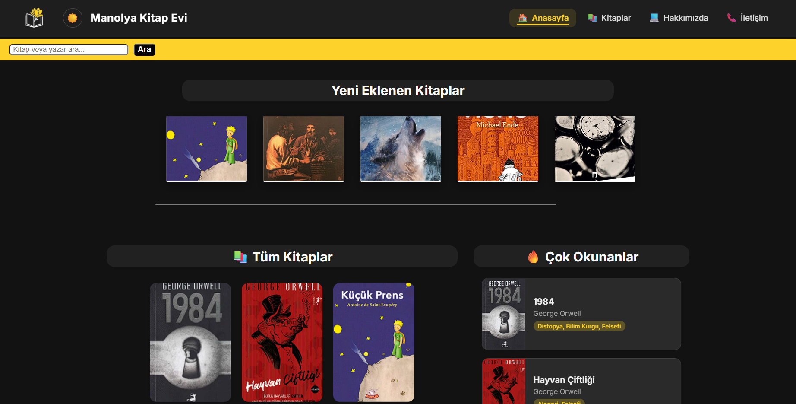
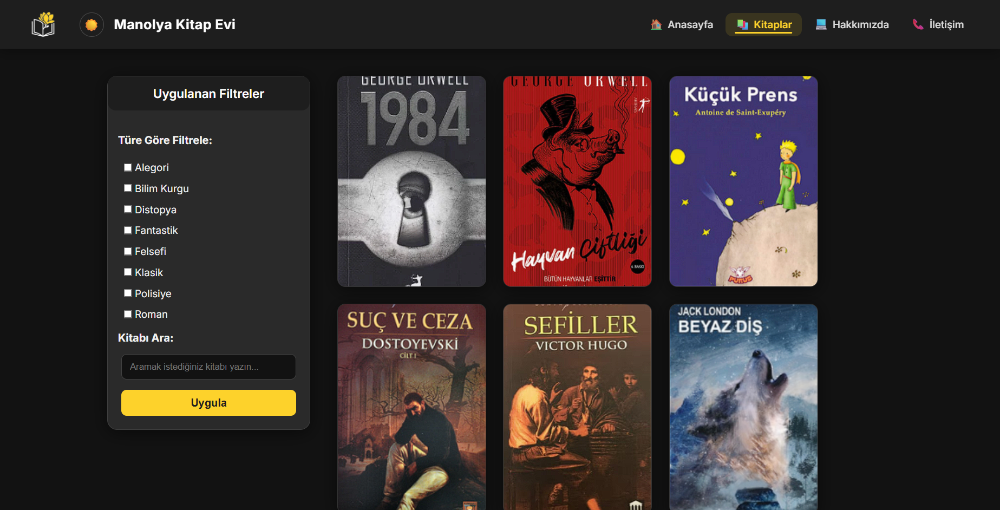
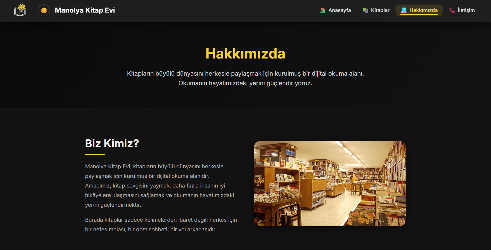
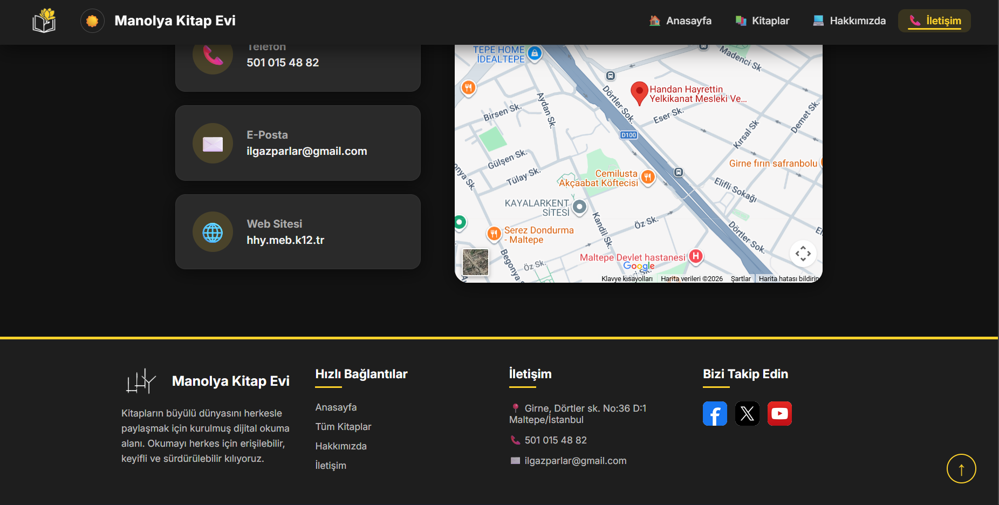
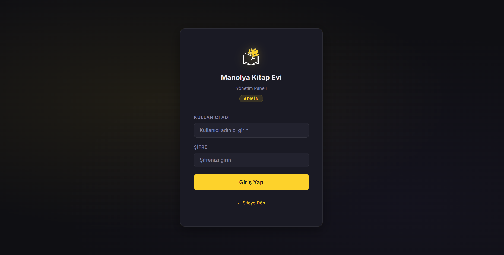
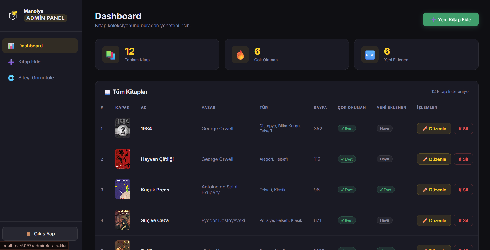
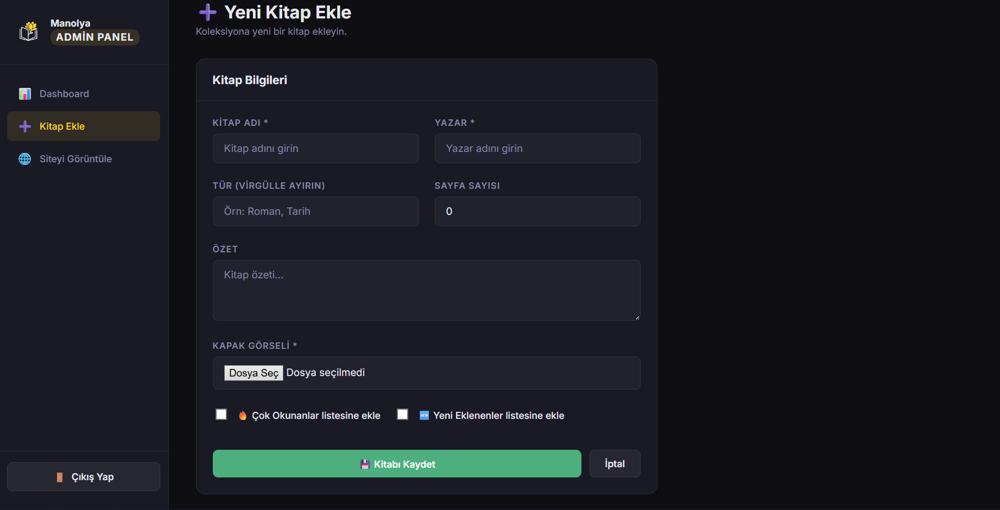

# 🌸 Manolya Kitap Evi - Dijital & Ücretsiz Kütüphane Platformu

**Manolya Kitap Evi**, okuma alışkanlığını herkes için erişilebilir, keyifli ve sürdürülebilir kılmak amacıyla **MVC** mimarisiyle geliştirilmiş, tamamen ücretsiz bir dijital kütüphane platformudur. Kullanıcılar her yerden kitaplara ulaşabilirken, yöneticiler gelişmiş bir **Admin Panel** üzerinden tüm kütüphane ekosistemini ve SQL veritabanını kontrol edebilir.

## ✨ Vizyon & Misyon
* **Vizyonumuz:** Okumayı herkes için erişilebilir bir alışkanlığa dönüştüren sıcak bir topluluk oluşturmak. Her yaştan okuyucunun kendini evinde hissedeceği bir dijital kütüphane olmayı hedefliyoruz.
* **Misyonumuz:** Kitap severlere ücretsiz, hızlı ve güvenli bir şekilde kitaplara ulaşabilecekleri bir alan sunmaktır. Okurken rahat hissetmeni, keşfederken ilham almanı ve istediğin her an okumaya devam edebilmeni sağlamak için buradayız.

---

## 🖼️ Proje Ekran Görüntüleri (Modüller)

Aşağıda platformun kullanıcı arayüzü ve yönetim paneline dair ekran görüntüleri yer almaktadır:

### 📱 Kullanıcı Arayüzü
| **Görsel** | **Açıklama** |
| :---: | :--- |
|  | **Anasayfa:** Dinamik istatistiklerin ve popüler kitapların listelendiği ana karşılama ekranı. |

|  | **Dijital Katalog:** Veritabanından seçilen kitapların dinamik olarak listelendiği keşif alanı. |

|  | **Kurumsal Vizyon:** Platformun amacını ve topluluk değerlerini yansıtan bölüm. |

|  | **İletişim:** Kullanıcı geri bildirimleri için kurgulanmış etkileşim sayfası. |

### 🔐 Yönetim Paneli (Admin Panel & CMS)
| **Görsel** | **Açıklama** |
| :---: | :--- |
|  | **Güvenli Erişim:** Admin paneline giriş için kullanılan yetkilendirme katmanı. |

|  | **Admin Dashboard:** Sistemin genel durumunu ve SQL verilerini takip etmeyi sağlayan yönetim merkezi. |

|  | **İçerik Yönetimi (CRUD):** Kitap ekleme, silme ve güncelleme işlemlerinin yapıldığı kontrol sayfası. |

---

## 🛠️ Teknik Özellikler ve Mimari

Bu proje, profesyonel bir mimari ile inşa edilmiştir:

* **MVC Design Pattern:** Kodun sürdürülebilirliğini artırmak için Model, View ve Controller katmanları birbirinden ayrılmıştır.
* **Dinamik Veri Yönetimi:** "En Çok Okunanlar" ve "Yeni Eklenenler" bölümleri, SQL sorguları aracılığıyla veritabanından dinamik olarak çekilir.
* **Full CRUD Operasyonları:** Admin panel üzerinden veritabanındaki kitap verileri üzerinde tam kontrol (Ekle, Sil, Güncelle) sağlanır.
* **İstatistiksel Analiz:** Kullanıcıların okuma verilerini işleyen ve görselleştiren mantıksal katman mevcuttur.

## 🚀 Kullanılan Teknolojiler
* **Backend:** [Kullandığın Dil ve Framework'ü Buraya Yazın]
* **Veritabanı:** SQL (İlişkisel Veri Modeli)
* **Frontend:** HTML5, CSS3, JavaScript, Bootstrap
* **Mimari:** MVC (Model-View-Controller)

---

## 📥 Kurulum ve Çalıştırma

1. Projeyi bilgisayarınıza klonlayın:

2. Veritabanı (SQL) bağlantı ayarlarını yapılandırma dosyalarınız üzerinden güncelleyin.

3. SQL scriptlerini veritabanı sunucunuzda çalıştırarak tabloları oluşturun.

4. Projeyi çalıştırın.

🔑 Admin Paneline Erişim
Yönetici paneline ulaşmak için tarayıcıda ana URL'nin sonuna /admin/dashboard yolunu eklemeniz gerekmektedir.

 Varsayılan Giriş Bilgileri:

  • Kullanıcı Adı: admin

  • Şifre: admin123

🔓 Lisans
Bu proje MIT Lisansı ile korunmaktadır. Özgürce kullanılabilir ve geliştirilebilir.
